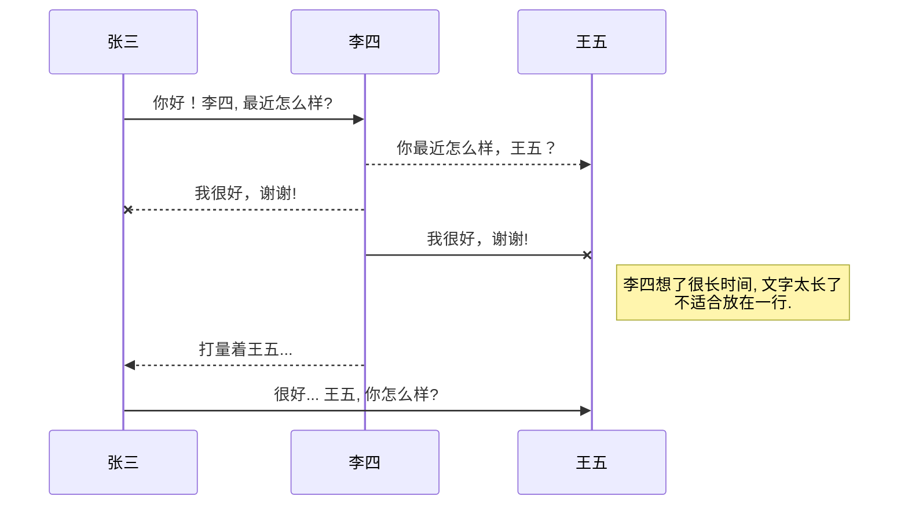

对比维度     | SOA     | 微服务
-------- | -----  | -----
服务粒度  | 粗  | 细
服务通信  | 重量级  | 轻量级，例如HTTP RESTFUL
服务交付  | 慢  | 快
应用场景  | 企业级  | 互联网

```mermaid
sequenceDiagram
张三 ->> 李四: 你好！李四, 最近怎么样?
李四-->>王五: 你最近怎么样，王五？
李四--x 张三: 我很好，谢谢!
李四-x 王五: 我很好，谢谢!
Note right of 王五: 李四想了很长时间, 文字太长了<br/>不适合放在一行.

李四-->>张三: 打量着王五...
张三->>王五: 很好... 王五, 你怎么样?
```